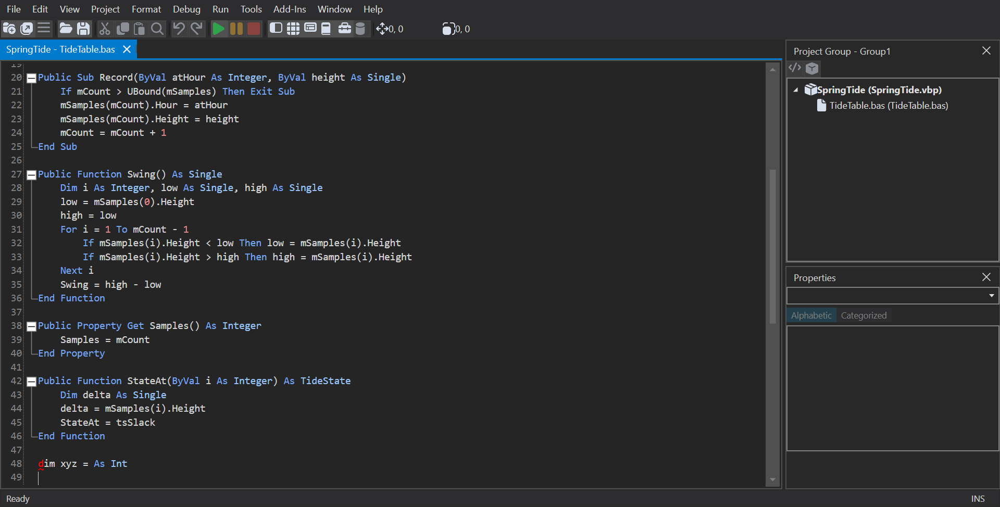

# Spring Tide

*(Different kind.)* Not an intro and not a fidelity check: a short module that exists to be **opened in
HexIDE with a foreign language server attached** — RDCore's — so you can see that server's folding regions and
syntax diagnostics rendered in HexIDE's editor.



It does not build. The last line, `dim xyz = As Int`, is a deliberate syntax error, because a diagnostic is
half of what it is here to show. There is no `Sub Main` either; nothing here runs.

## What comes from where

Everything **coloured** is HexIDE's own lexical highlighting (`IDE/HexIDE/Resources/TextHighlighting/VB6.xshd.xml`),
which needs no server at all. What RDCore supplies:

| On screen | Protocol |
|---|---|
| The fold markers in the gutter | `textDocument/foldingRange` — six regions: `Enum`, `Type`, `Sub`, `Function`, `Property Get`, `Function` |
| The red squiggle on line 48 | `textDocument/diagnostic` — one `VBC00001` syntax error |

To see it for yourself rather than take the screenshot's word for it, launch with `--capture-lsp` and open
**Tools → Protocol Inspector**: both requests and their answers are there.

## Running it

**You need a published RDCore language server that includes
[rubberduck-vba/RDCore#260](https://github.com/rubberduck-vba/RDCore/pull/260)** (merged as `0ed29c9`).
Before it, answering `textDocument/diagnostic` killed the server's entire output channel, so the first pull
silenced everything after it. From an RDCore checkout at or after that commit, run its `PlatformPublish.ps1`.
Measured on Windows, over a named pipe.

**1. Attach the server.** Add this entry to `lsp-servers.json` — [where that file
lives](../../docs/language-servers.md#where-the-file-lives) — with `command` pointing at your published
`RDCore.LanguageServer.exe`:

```json
{
  "servers": [
    {
      "id": "rdcore-vba",
      "displayName": "RD-VBA (RDCore)",
      "extensions": [".bas", ".cls", ".frm"],
      "languageId": "vba",
      "transport": "pipe",
      "pipeName": "HexIDE.RDCore",
      "pipeRole": "connect",
      "command": "C:/path/to/publish/RDCore.LanguageServer/RDCore.LanguageServer.exe",
      "arguments": "--pipe-name {pipe} --workspace {workspaceUri}",
      "priority": 10
    },
    { "id": "hexide.vb6", "enabled": false }
  ]
}
```

The second entry switches off HexIDE's bundled VB6 server. Folding would come from RDCore anyway, because
only the highest-priority server is asked for folds. **Diagnostics would not**: HexIDE merges every server's
diagnostics into one set, so with both attached you would be looking at two servers' opinions at once.
Delete that entry afterwards, or VB6 files get no language service whenever RDCore is not configured.
Changes take effect on restart.

**2. Open it.**

```sh
cd IDE && dotnet run --project HexIDE.Desktop/ -- ../demo/spring-tide/SpringTide.vbp
```

Then double-click **TideTable.bas** in the Project Explorer. The server starts on that first open; allow a
few seconds for its workspace to load.

## Why it is set up the way it is

**`.rdproj`.** RDCore analyses only modules listed in a `.rdproj` at the workspace root, and HexIDE hands it
the directory holding the `.vbp`. Without this file every request is answered — successfully, and with
nothing in it — which looks exactly like clean code. It is the output of `rdc new`, trimmed: the scaffolder
records an absolute path to the local Office install's `VBE7.DLL`, and an empty `References` list gives the
same folds and diagnostics without tying the file to one machine. Keys are PascalCase; a camelCase file loads
without complaint and lists no modules.

**`RelatedDoc=`, not `Module=`.** `SpringTide.vbp` carries `TideTable.bas` as a related document. That is a
workaround, and it is the reason this demo works at all:

- As a module, HexIDE names the file to servers as `vb6://module/TideTable`
  ([#273](https://github.com/hexide-io/HexIDE/issues/273)). RDCore implements no document sync, never
  receives the text, and knows the file only by its `file:` path, so every answer about the `vb6:` name
  comes back empty. A carried document is named by its real path.
- A module opened before its server has initialized also never asks for folds
  ([#446](https://github.com/hexide-io/HexIDE/issues/446)). The carried-document view asks again once
  diagnostics arrive; the module view does not.

When #273 is fixed this should become an ordinary `Module=` line, and that change is the test that it was.

**The error is after the last member, not inside one.** RDCore's parser does not recover after a syntax
error: everything below the first one gets no folds and no diagnostics, and the member containing it is cut
short at the error. With the bad line inside `StateAt`, that fold ended on the error line instead of at
`End Function` — which is the range RDCore reports, but reads as a HexIDE folding bug. On a line of its own
after the last `End Function`, every fold above it is whole.

**The squiggle is one character wide.** RDCore's diagnostic ranges are zero-width (`start` equals `end`);
HexIDE widens a zero-width range to a single character so it can be seen at all.
